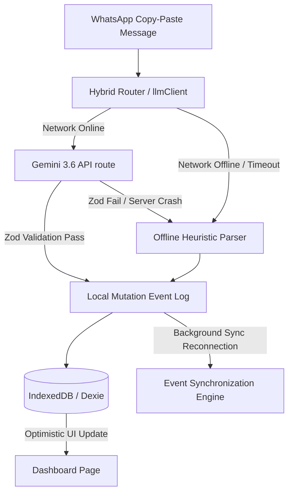

# Offline-First Order Management System PWA

A high-performance, resilient, local-first Progressive Web App (PWA) designed for micro-enterprises operating in emerging economies with severe and unpredictable network partitions. It allows operators to manage order intakes, parse unstructured Hinglish/Devanagari messages into structured commerce records, track financial outstanding balances, and synchronize data across devices with deterministic conflict resolution.

---

## 1. Core Technology Stack

The application employs a modern, offline-first client architecture built to minimize network dependencies and run smoothly on mid-range Android devices:

* **Framework**: Next.js 16 (App Router) with React 19.
* **Service Worker & PWA Caching**: `@serwist/next` (the modern successor to `next-pwa`) managing service worker registration, static app shell caching (PrecacheAndRoute), and offline availability.
* **Client-Side Persistence**: `dexie` and `dexie-react-hooks` for reactive IndexedDB abstraction, enabling sub-millisecond, non-blocking queries and mutations.
* **Schema Validation**: `zod` for strict runtime structure enforcement, capturing LLM hallucinations or corrupted replication streams.
* **State & Synchronization**: Event-Sourced append-only mutation logs tracked by Hybrid Logical Clocks (HLC) for eventually consistent multi-device synchronization.

---

## 2. Architecture & Offline-First Data Flow

### Critical Render Path & sub-5MB Payload
* **Precaching**: The Serwist service worker interceptor caches all static code assets, assets (CSS, JS), and Google Web Fonts (`Outfit`) upon first load, completely bypassing the network for subsequent cold starts.
* **IndexedDB Reactivity**: React components consume IndexedDB datasets using Dexie `useLiveQuery` observables, updating the user interface instantly upon write mutations without relying on blocking API cycles.
* **Persistent Browser Storage**: Explicitly requests origin persistent storage (`navigator.storage.persist()`) during application startup, preventing browsers from evicting local data during device storage pressure.

---

## 3. NLP Parsing Pipeline

To accommodate unstable networks, the parsing engine operates on a hybrid pipeline:

### A. Primary Online Path (Gemini 3.6 Flash)
When connected, requests are sent to `/api/parse-order` leveraging Google Gemini 3.6 Flash:
* **System Prompt Constraints**: Aggressively configured to reject conversational filler/questions (e.g. *"ho jayega kya?"*, *"bhaiya"*) and filter out temporal expressions.
* **JSON Schema Enforcement**: Uses the model's native `responseSchema` and `responseMimeType: "application/json"` parameters to guarantee structural compliance.
* **Timeout Shield**: Enforces a `15000ms` (15 seconds) client timeout to prevent browser UI freezing during model cold starts.

### B. Fallback Offline Path (Algorithmic Regex Engine)
If offline, rate-limited, or timed out, processing defaults immediately to [nlpParser.ts](file:///Users/rouneet/Documents/rxcodes/rxdev/smoothatdevcraft/src/lib/nlpParser.ts):
1. **Transliteration Normalizer**: Standardizes Devanagari numerals (`०-९`) and prepositions to standard Romanized counterparts.
2. **Date & Amount Stripping**: Strips price patterns (`rs 1200`, `1200/-`) and temporal details (`kal`, `parso`, `sham tak`) from lines *first*, preventing them from leaking into the final item descriptions.
3. **Dictionary-Based Translations**: Maps common Hindi/Hinglish grocery and catering nouns to English (e.g. `aaloo` -> `potato`, `pyaaz` -> `onion`, `doodh` -> `milk`, `चीनी` -> `sugar`).
4. **Colloquial Date Math**: Translates relative tokens mathematically relative to the system date (e.g. `"parso"` -> `baseDate + 2 days`, `"agle mangalwar"` -> next Tuesday).
5. **Safety Flagging**: Sets `needs_clarification: true` for missing quantities on bulk commodities or highly ambiguous strings.

---

## 4. Offline Sync & Conflict Resolution

Replicating data across disconnected client nodes requires a robust, eventually consistent replication architecture. Resolv implements an **Operation-Log based synchronization** system to achieve this:

1. **Operations as Single Source of Truth**: Every offline mutation (creation, deletion, updates, or resolution) is persisted locally as an `Operation` object:
   * `operationId`: UUIDv4 identifier acting as an idempotency key.
   * `deviceId`: Stable device identifier persisted in `localStorage`.
   * `timestamp`: Unix timestamp (ms) representing the time the mutation occurred.
   * `orderId`: Target order ID.
   * `type`: Mutation action (`CREATE_ORDER`, `DELETE_ORDER`, `UPDATE_FIELD`, `RESOLVE_CONFLICT`).
   * `field` & `newValue` & `oldValue`: Captured metadata for fine-grained changes.
2. **Deterministic Convergence (Reconnection Order Independence)**: Convergence is entirely independent of network transport/server arrival order. All incoming and local operations are sorted deterministically using the tie-breaker:
   
       timestamp ──> deviceId ──> operationId
   
   If timestamps are identical, the deviceId is compared lexicographically; if those also collide, the operationId is compared lexicographically. This ensures that every peer replays operations in the exact same logical sequence.
   
   > [!IMPORTANT]
   > We do not use server arrival/reconnection order as the conflict-resolution mechanism because that would make convergence dependent on network timing.
3. **Idempotency**: Duplicate operations received via network retries are identified by `operationId` and ignored, ensuring sync runs are completely idempotent.
4. **Conflict Resolution Rules**:
   * **Different Fields**: Changes to different fields of the same order (e.g. Device A edits `due_date`, Device B edits `amount`) merge automatically.
   * **Same Field, Same Value**: Changes to the same field proposing the same value converge automatically without conflict.
   * **Same Field, Different Values**: Concurrent edits to the same field proposing different values create a surfaced conflict record in the database. Both proposed values are preserved (no silent data loss).
   * **Resolution Logging**: Manual operator conflict resolutions are recorded and propagated as `RESOLVE_CONFLICT` operations.
   * **Delete vs Update**: If one device deletes an order while another modifies it concurrently, a conflict is surfaced (`[Confirm Deletion]` / `[Restore Order]`). Tombstones prevent silent order resurrection.

---

## 5. Operational Dashboard (Epic 4 Queries)

Designed as a non-scrolling single-viewport cockpit, the query layer answers four core operational directives:
1. **Temporal Triage**: Separates items due today (Amber alert) and past due incomplete items (Rose alert).
2. **Financial Outstanding Debt**: Consolidates unpaid customer debt in a descending ledger grouped by customer name.
3. **Historical Continuity**: Pulls the attributes (e.g. sizes, units) of the chosen customer's most recent order to pre-fill repeated requests.
4. **Capacity Planner**: Aggregates rolling 7-day workload quantities against a threshold (60 units) to visually warn operators when fully committed.

---

## 6. Known System Limitations

* **Colloquial Date Parser**: The offline fallback engine is designed for standard relative dates. It cannot resolve highly complex, nested temporal prose, obscure regional dialects, or financial quarter references.
* **Replication Storage Cost**: Because of event sourcing, the `event_log` table grows indefinitely as mutations are registered. Long-term operations will require a compaction/snapshotting strategy to avoid browser quota limits.
* **IndexedDB Origin Constraints**: iOS/Safari and Android/Chrome enforce dynamic client storage limits (ranging from 1GB to 60% of free disk space). Under critical low space, the browser might warn of `QuotaExceededError` if the origin fails to secure persistent status.
