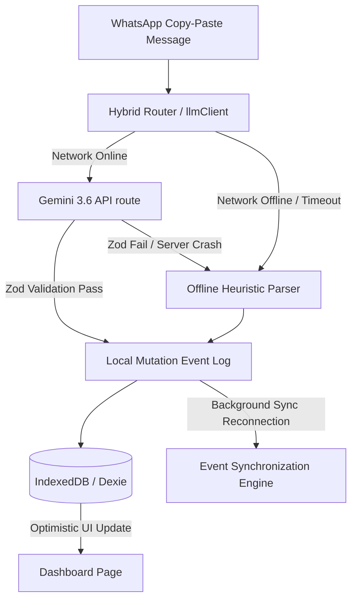

# Offline-First Order Management System PWA

A high-performance, resilient, local-first Progressive Web App (PWA) designed for micro-enterprises operating in emerging economies with severe and unpredictable network partitions. It allows operators to manage order intakes, parse unstructured Hinglish/Devanagari messages into structured commerce records, track financial outstanding balances, and synchronize data across devices with deterministic conflict resolution.

---

## 1. Core Technology Stack

The application employs a modern, offline-first client architecture built to minimize network dependencies and run smoothly on mid-range Android devices:

* **Framework**: Next.js 16 (App Router) with React 19.
* **Service Worker & PWA Caching**: `@serwist/next` (the modern successor to `next-pwa`) managing service worker registration, static app shell caching (PrecacheAndRoute), and offline availability.
* **Client-Side Persistence**: `dexie` and `dexie-react-hooks` for reactive IndexedDB abstraction, enabling sub-millisecond, non-blocking queries and mutations.
* **Schema Validation**: `zod` for strict runtime structure enforcement, capturing LLM hallucinations or corrupted replication streams.
* **State & Synchronization**: Event-Sourced append-only mutation logs tracked by Hybrid Logical Clocks (HLC) for eventually consistent multi-device synchronization.

---

## 2. Architecture & Offline-First Data Flow



### Critical Render Path & sub-5MB Payload
* **Precaching**: The Serwist service worker interceptor caches all static code assets, assets (CSS, JS), and Google Web Fonts (`Outfit`) upon first load, completely bypassing the network for subsequent cold starts.
* **IndexedDB Reactivity**: React components consume IndexedDB datasets using Dexie `useLiveQuery` observables, updating the user interface instantly upon write mutations without relying on blocking API cycles.
* **Persistent Browser Storage**: Explicitly requests origin persistent storage (`navigator.storage.persist()`) during application startup, preventing browsers from evicting local data during device storage pressure.

---

## 3. NLP Parsing Pipeline

To accommodate unstable networks, the parsing engine operates on a hybrid pipeline:

### A. Primary Online Path (Gemini 3.6 Flash)
When connected, requests are sent to `/api/parse-order` leveraging Google Gemini 3.6 Flash:
* **System Prompt Constraints**: Aggressively configured to reject conversational filler/questions (e.g. *"ho jayega kya?"*, *"bhaiya"*) and filter out temporal expressions.
* **JSON Schema Enforcement**: Uses the model's native `responseSchema` and `responseMimeType: "application/json"` parameters to guarantee structural compliance.
* **Timeout Shield**: Enforces a `15000ms` (15 seconds) client timeout to prevent browser UI freezing during model cold starts.

### B. Fallback Offline Path (Algorithmic Regex Engine)
If offline, rate-limited, or timed out, processing defaults immediately to [nlpParser.ts](file:///Users/rouneet/Documents/rxcodes/rxdev/smoothatdevcraft/src/lib/nlpParser.ts):
1. **Transliteration Normalizer**: Standardizes Devanagari numerals (`०-९`) and prepositions to standard Romanized counterparts.
2. **Date & Amount Stripping**: Strips price patterns (`rs 1200`, `1200/-`) and temporal details (`kal`, `parso`, `sham tak`) from lines *first*, preventing them from leaking into the final item descriptions.
3. **Dictionary-Based Translations**: Maps common Hindi/Hinglish grocery and catering nouns to English (e.g. `aaloo` -> `potato`, `pyaaz` -> `onion`, `doodh` -> `milk`, `चीनी` -> `sugar`).
4. **Colloquial Date Math**: Translates relative tokens mathematically relative to the system date (e.g. `"parso"` -> `baseDate + 2 days`, `"agle mangalwar"` -> next Tuesday).
5. **Safety Flagging**: Sets `needs_clarification: true` for missing quantities on bulk commodities or highly ambiguous strings.

---

## 4. Offline Sync & Conflict Resolution

Replicating data across distributed peer nodes (e.g. operator's phone and a tablet, or multiple staff members going offline) requires deterministic convergence without silent data loss.

### A. Operation-Log Model
Every offline mutation to an order is represented as an immutable, structured **Operation**:
```typescript
interface Operation {
  operationId: string;    // UUID / unique identifier
  deviceId: string;       // Persistent client device identifier
  orderId: string;        // Target Order ID
  timestamp: number;      // Epoch timestamp (ms)
  type: "CREATE_ORDER" | "UPDATE_FIELD" | "DELETE_ORDER" | "RESOLVE_CONFLICT";
  field?: string;         // Target field (e.g. "amount", "due_date", "customer", "items")
  oldValue?: unknown;     // Previous value for auditability
  newValue?: unknown;     // Proposed mutation value
  conflictId?: string;    // Conflict reference for RESOLVE_CONFLICT operations
  synced?: boolean;       // Local sync acknowledgment status
}
```

### B. Persistent Local Operation Queue & Device ID
* **Device ID**: Each client maintains a persistent, unique device identifier stored in `localStorage.getItem("deviceId")`. It remains stable across browser sessions without depending on human operator names.
* **Persistent Queue**: When a user modifies an order while offline:
  1. The change is optimistically applied to the local view in IndexedDB (`db.orders`).
  2. An operation record is created with `synced: false`.
  3. The operation is appended to the persistent IndexedDB queue (`db.operations`).
  4. The operation queue survives application restarts, page reloads, and browser closures.

### C. Idempotent Synchronization Protocol
When connectivity returns:
1. The client reads all unsynced operations from `db.operations` and sends them via `POST /api/sync`.
2. The server processes incoming operations using `operationId` as an **idempotency key**. Duplicate operations caused by network retries are applied exactly once.
3. The server merges the incoming operations with its master operation log and returns any operations missing on the client.
4. The client marks acknowledged operations as `synced: true` and deterministically replays remote operations.

### D. Deterministic Total Ordering
To guarantee that all nodes converge to the identical state regardless of network routing, operations are strictly ordered using:
$$\text{timestamp} \longrightarrow \text{deviceId} \longrightarrow \text{operationId}$$

```typescript
function compareOperations(a: Operation, b: Operation): number {
  if (a.timestamp !== b.timestamp) {
    return a.timestamp - b.timestamp; // Earlier timestamp first
  }
  const devCmp = a.deviceId.localeCompare(b.deviceId); // Deterministic tie-breaker 1
  if (devCmp !== 0) return devCmp;
  return a.operationId.localeCompare(b.operationId);    // Deterministic tie-breaker 2
}
```

> [!IMPORTANT]
> **Why Reconnection Order is Never Used**:
> We do NOT use server arrival or reconnection order as the conflict-resolution mechanism because that would make convergence dependent on network transport latency. **Reconnection order is transport order, not business-decision order.** The same set of offline operations produces the exact same final state whether the phone or tablet reconnects first.

### E. Merge & Conflict Policies
1. **Non-Conflicting Merge**: If Device A edits `amount` and Device B edits `due_date`, both edits merge cleanly into the order.
2. **Same-Value Convergence**: If Device A and Device B both set `quantity` to `15`, the system converges automatically without creating an unnecessary conflict.
3. **Explicit Conflict Surfacing**: If Device A sets `quantity = 15` and Device B sets `quantity = 20`:
   - Neither value is silently overwritten or discarded.
   - An explicit `ConflictRecord` is generated preserving **both** proposed values (`15` and `20`), their device IDs, and their timestamps.
   - The order's `needs_clarification` flag is raised (`true`), alerting operators in the dashboard.
4. **Delete vs. Update Safety**: If Device A deletes an order while Device B updates it offline, a deletion conflict is surfaced (`[Keep Deleted]` vs. `[Restore Order]`). The order is never silently resurrected or purged.
5. **Auditable Conflict Resolution**: When an operator resolves a conflict in the UI, a new `RESOLVE_CONFLICT` operation is generated, preserving the full audit trail across all devices.

---

## 5. Operational Dashboard (Epic 4 Queries)

Designed as a non-scrolling single-viewport cockpit, the query layer answers four core operational directives:
1. **Temporal Triage**: Separates items due today (Amber alert) and past due incomplete items (Rose alert).
2. **Financial Outstanding Debt**: Consolidates unpaid customer debt in a descending ledger grouped by customer name.
3. **Historical Continuity**: Pulls the attributes (e.g. sizes, units) of the chosen customer's most recent order to pre-fill repeated requests.
4. **Capacity Planner**: Aggregates rolling 7-day workload quantities against a threshold (60 units) to visually warn operators when fully committed.

---

## 6. Known System Limitations

* **Colloquial Date Parser**: The offline fallback engine is designed for standard relative dates. It cannot resolve highly complex, nested temporal prose, obscure regional dialects, or financial quarter references.
* **Replication Storage Cost**: Because of event sourcing, the `event_log` table grows indefinitely as mutations are registered. Long-term operations will require a compaction/snapshotting strategy to avoid browser quota limits.
* **IndexedDB Origin Constraints**: iOS/Safari and Android/Chrome enforce dynamic client storage limits (ranging from 1GB to 60% of free disk space). Under critical low space, the browser might warn of `QuotaExceededError` if the origin fails to secure persistent status.
